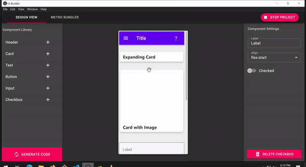
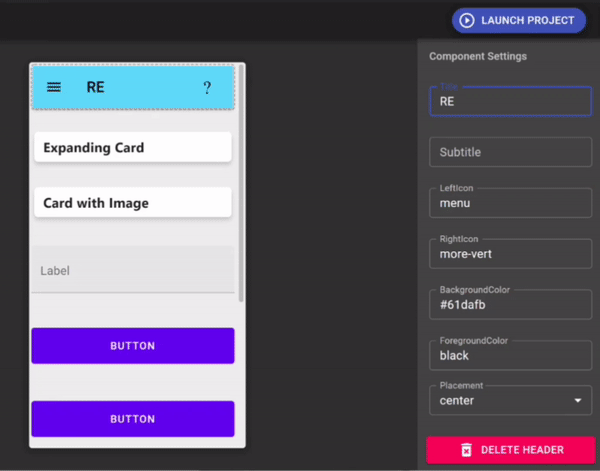

# Desktop App for building crude react-native UI layouts

## Drag n Drop

## Coloring

## Order

Electron Desktop Application that allows you to lay out react-native components for mobile apps and export actual projects without coding

```
npm i -g electron yarn
git clone
cd build-app-UI-react-native
yarn
yarn start
```



